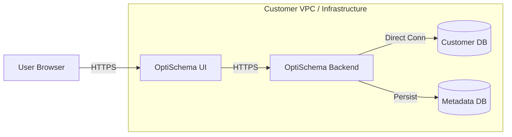

# OptiSchema Product Architecture & Roadmap

**Version**: 1.0  
**Date**: 2025-11-25  
**Status**: Draft  

---

## 1. Product Vision
OptiSchema is an AI-driven performance optimization platform for PostgreSQL databases. It analyzes query metrics, schema definitions, and workload patterns to provide actionable recommendations (indexes, configuration tuning, query rewrites) that improve performance and reduce costs.

To serve diverse customer needs—from security-conscious enterprises to fast-moving startups—OptiSchema supports two distinct deployment models: **Standalone (Self-Hosted)** and **SaaS (Agent-Based)**.

---

## 2. Deployment Modes

### Mode A: Standalone (Self-Hosted)
*The "Enterprise / On-Prem" Solution*

In this mode, the customer deploys the entire OptiSchema stack (Frontend, Backend, Metadata DB) within their own infrastructure (VPC/On-Prem).

*   **Target Audience**: Banks, Healthcare, Government, and enterprises with strict data residency/compliance requirements.
*   **Data Flow**: No data leaves the customer's network. AI analysis can be routed through a private gateway or local LLM if configured.
*   **Connectivity**: Direct connection to target databases via standard PostgreSQL protocol.
*   **Pros**:
    *   ✅ **Maximum Security**: Database credentials and data never leave the customer VPC.
    *   ✅ **Compliance**: Easiest path for SOC2/HIPAA/GDPR since data is self-contained.
    *   ✅ **Control**: Customer controls updates and maintenance windows.
*   **Cons**:
    *   ❌ **Maintenance**: Customer must manage the OptiSchema infrastructure (Docker/K8s).
    *   ❌ **Updates**: Manual update process.

**Architecture**:


### Mode B: SaaS (Agent-Based)
*The "Cloud Native / Managed" Solution*

In this mode, OptiSchema hosts the control plane (UI/Backend), and the customer deploys a lightweight **Agent** in their infrastructure.

*   **Target Audience**: Startups, SMBs, and cloud-native companies who want "plug-and-play" optimization without managing infrastructure.
*   **Data Flow**:
    *   **Agent** collects metrics (anonymized query stats) and sends to SaaS via HTTPS.
    *   **SaaS** runs AI analysis and generates recommendations.
    *   **Agent** pulls recommendations.
    *   **Customer** approves changes in SaaS UI -> Agent applies them locally.
*   **Connectivity**: Agent makes outbound HTTPS requests to SaaS. **No inbound ports required.**
*   **Pros**:
    *   ✅ **Zero Maintenance**: OptiSchema manages the platform.
    *   ✅ **Secure**: **Database credentials NEVER leave the customer environment.**
    *   ✅ **Easy Setup**: `docker run optischema-agent` and you're done.
*   **Cons**:
    *   ❌ **Data Egress**: Query metrics (metadata) leave the network (though no PII/credentials).

**Architecture**:
```mermaid
graph LR
    subgraph "OptiSchema SaaS Cloud"
        UI[Dashboard]
        API[SaaS API]
        AI[AI Engine]
        MetaDB[(SaaS DB)]
    end

    subgraph "Customer Infrastructure"
        Agent[OptiSchema Agent]
        TargetDB[(Customer DB)]
    end

    Agent -->|HTTPS (Metrics)| API
    API -->|HTTPS (Recommendations)| Agent
    Agent -->|Local Conn| TargetDB
    User[User] -->|HTTPS| UI
```

---

## 3. Current Technical State

### Core Backend
*   **Framework**: FastAPI (Python 3.11)
*   **Database**: PostgreSQL (AsyncPG)
*   **Multi-Tenancy**: Fully implemented.
    *   *Isolation*: Per-tenant connection pools, collector tasks, and database rows.
    *   *Context*: `TenantContext` middleware ensures data isolation.

### Caching Strategy
*   **Architecture**: **Hybrid Caching** (Cost-Effective & Scalable)
    *   **L1 (Local)**: In-Memory cache (30s TTL) for ultra-fast metric retrieval (0.1ms).
    *   **L2 (Shared)**: PostgreSQL Metadata DB for persistence and consistency (2-5ms).
*   **Scalability**: Designed to run behind a Load Balancer. Local cache handles 95% of read load; Postgres ensures eventual consistency.

### Security Status
*   **Strengths**:
    *   SQL Injection prevention (parameterized queries).
    *   Encryption at rest (Fernet) for stored credentials (in Standalone mode).
*   **Critical Gaps (To Be Fixed)**:
    *   Authentication is currently **disabled by default**.
    *   API endpoints lack authentication enforcement.
    *   CORS is overly permissive (`*`).
    *   No rate limiting on expensive AI endpoints.
    *   **Direct Connection Mode (Legacy)**: Currently transmits credentials over API, which is **unsafe for SaaS**. *Solution: Move to Agent Mode.*

---

## 4. Detailed Current State Analysis

### A. Metrics Collection Matrix
The platform collects the following raw metrics from `pg_stat_statements` every 30 seconds (configurable):

| Metric Category | Metric Name | Description | Purpose |
| :--- | :--- | :--- | :--- |
| **Execution** | `calls` | Number of times executed | Identify high-frequency queries |
| | `total_time` | Total time spent executing | Identify highest load queries |
| | `mean_time` | Average execution time | Baseline performance metric |
| | `min/max_time` | Min/Max execution time | Detect performance variance |
| | `stddev_time` | Standard deviation | Stability indicator |
| **I/O & Buffers** | `shared_blks_hit` | Cache hits | Memory efficiency |
| | `shared_blks_read` | Disk reads | I/O bottleneck detection |
| | `shared_blks_written` | Disk writes | Write load analysis |
| | `temp_blks_read/written` | Temp file usage | Sort/Hash memory issues |
| **Data** | `rows` | Rows retrieved/affected | Data volume analysis |

**Derived Metrics**:
*   **Performance Score (0-100)**: Calculated based on execution time, call frequency, and cache hit ratio.
*   **Time Percentage**: % of total database load contributed by a specific query.

### B. Collection Mechanism
*   **Source**: `pg_stat_statements` extension in PostgreSQL.
*   **Method**: Polling (Pull model).
*   **Frequency**: Every 30 seconds (default).
*   **Filtering**:
    *   Excludes system queries (`pg_catalog`, `information_schema`).
    *   Excludes maintenance commands (`BEGIN`, `COMMIT`, `SET`).
    *   Adaptive sampling for large datasets (>100k queries).
*   **Storage**:
    *   **Hot**: In-Memory (last 30s).
    *   **Warm**: PostgreSQL Metadata DB (historical trends).

### C. Feature & Screen Breakdown

#### 1. Dashboard Overview (`/dashboard`)
*   **KPI Banner**: Real-time summary of DB health (Active Connections, Cache Hit Ratio, TPS).
*   **Top Queries**: Table of most expensive queries by total time.
*   **Performance Charts**: Time-series visualization of load and latency.

#### 2. Optimization Engine (`/dashboard/optimizations`)
*   **AI Recommendations**: Generative AI analysis of query patterns.
    *   *Types*: Index suggestions, Query rewrites, Configuration tuning.
*   **Risk Assessment**: AI-evaluated risk level (Low/Medium/High).
*   **Actionable Fixes**: One-click "Apply" button for generated SQL fixes.

#### 3. Analytics Deep Dive (`/dashboard/analytics`)
*   **Query Heatmap**: Visual representation of query load over time.
*   **Latency Trends**: Historical performance tracking.
*   **Export**: Download metrics as CSV/JSON.

#### 4. Index Advisor (`/dashboard/index-advisor`)
*   **Unused Index Detection**: Identifies indexes that are never scanned.
*   **Redundant Indexes**: Finds overlapping or duplicate indexes.
*   **Impact Analysis**: Estimated storage and write-overhead savings.

#### 5. Audit Log (`/dashboard/audit`)
*   **Change Tracking**: Records all applied recommendations.
*   **User Actions**: Logs who applied changes and when.
*   **Rollback History**: Tracks reverted changes.

#### 6. Connection Manager (`/dashboard/baselines`)
*   **Baseline Creation**: Snapshots of performance before changes.
*   **Comparison**: A/B testing of performance (Pre vs Post optimization).

---

## 5. Product Roadmap

### Phase 1: Security Hardening (Immediate Priority)
*Goal: Make the platform safe for deployment.*
1.  **Enable Authentication**: Enforce JWT auth on all endpoints by default.
2.  **Secure API**: Fix CORS, add Rate Limiting (SlowAPI), enforce HTTPS.
3.  **Secrets Management**: Move secrets from env vars to secure storage (AWS Secrets Manager).
4.  **Audit Logging**: Log all auth attempts and DDL operations.

### Phase 2: Agent Implementation (Weeks 2-4)
*Goal: Enable the secure SaaS business model.*
1.  **Build Agent**: Lightweight Python/Go binary or Docker container.
    *   Capabilities: Connect to local DB, poll `pg_stat_statements`, push metrics, pull/apply recommendations.
2.  **Agent API**: Create SaaS endpoints for Agent registration, heartbeat, and metric ingestion.
3.  **Deprecate Direct Connect**: Remove the "Enter DB Password" UI from the SaaS version.

### Phase 3: Infrastructure Scalability (Month 2+)
*Goal: Support 500+ tenants cost-effectively.*
1.  **Database Orchestration**: Move from single DB to **Patroni + PgBouncer** (Self-Hosted HA).
    *   *Benefit*: High Availability and Connection Pooling without RDS costs.
2.  **Advanced Caching**: Introduce Redis if/when L1/L2 hybrid cache latency exceeds targets.

---

## 6. Summary of Viable Approaches

| Feature | Standalone (Self-Hosted) | SaaS (Agent-Based) |
| :--- | :--- | :--- |
| **Best For** | Enterprise, Security-First, On-Prem | Startups, SMBs, Cloud-Native |
| **Setup** | Complex (Docker/K8s) | Simple (1 Docker container) |
| **Maintenance** | Customer Managed | Managed by OptiSchema |
| **Credential Safety** | ✅ Stays in VPC | ✅ Stays in VPC (Agent) |
| **Data Privacy** | ✅ 100% Private | ⚠️ Metrics sent to SaaS |
| **Connectivity** | Direct DB Connection | Outbound HTTPS Only |
| **Cost Model** | License / Seat | Subscription / Usage |

**Recommendation**: Develop **SaaS (Agent-Based)** as the primary go-to-market product for friction-less adoption, while offering **Standalone** as a premium "Enterprise" tier.
